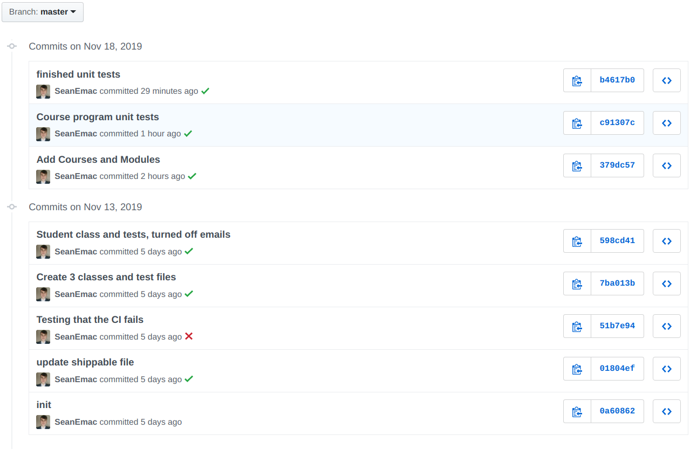
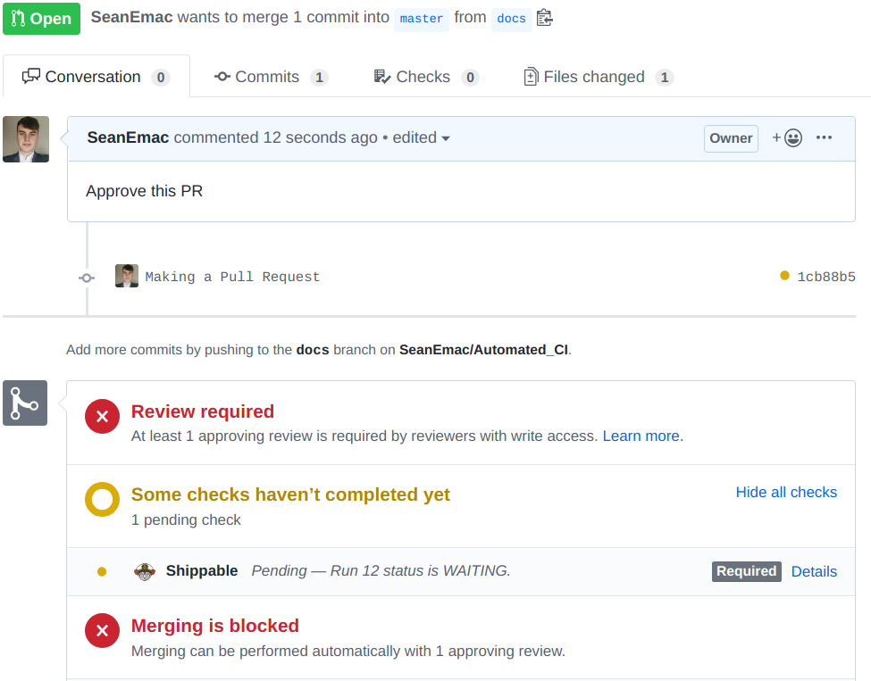
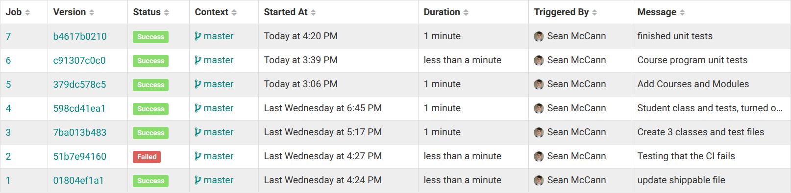
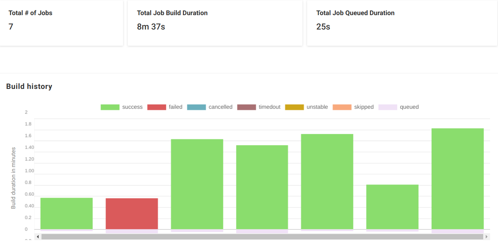

# Simple CI Pipeline with Shippable

This project uses Maven, JUnit and Shippable to create a simple Java CI pipeline.

## Maven
Maven is a build automation tool used to manage dependencies, compile, build and test the code. This project uses JUnit and Joda Time which are imported in pom.xml.

When shippable pulls the new code, it runs:

`mvn clean install`

`mvn test` 

## Git
Git is used as version control system. Local changes are tracked and can be staged for commit. This can then be pushed to a remote repository on github where other people can view and checkout their own version of the code.

Github can be configured to block pull requests being merged until the code has been reviewed and the CI job passes. 

## Shippable
Shippable is a simple DevOps tool that allows you to easily create CI pipelines. It integrates with github with hooks to tell when new code has been pushed, the **shippable.yml** file tells Shippable how to build and test your code.

